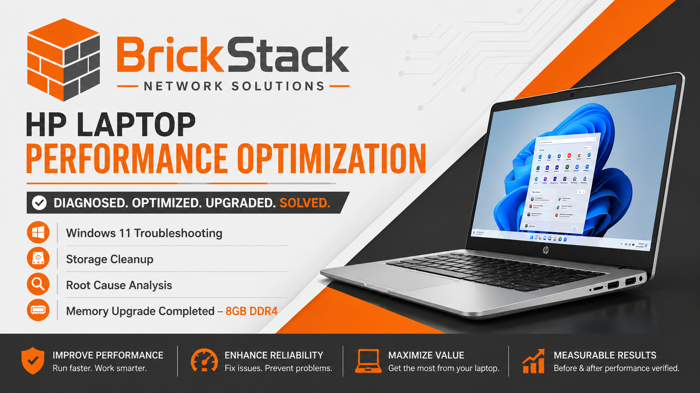

# HP Laptop Performance Optimization & Root Cause Analysis

**Project Type:** Endpoint Troubleshooting & Performance Optimization

**Completed By:** Cierra Emerson | BrickStack Network Solutions

**Date:** June 2026

---

# Executive Summary

A customer contacted BrickStack Network Solutions regarding an HP laptop experiencing severe performance issues during normal use. The customer reported slow application launches, sluggish system responsiveness, and an overall poor user experience.

A structured diagnostic process was performed to identify the root cause, optimize system performance, and provide recommendations for long-term improvement.

---

# Customer Complaint

The customer reported:

* Extremely slow system performance
* Delayed application launches
* General system sluggishness
* Poor multitasking performance

---

# Device Information

# Device Information

| Component | Details |
|------------|------------------------------|
| Manufacturer | HP |
| Model | HP Laptop 14-dq3230nr |
| Operating System | Windows 11 Home 25H2 |
| Processor | Intel Celeron N4500 @ 1.10 GHz |
| Installed Memory (Initial) | 4GB Samsung DDR4-3200 |
| Installed Memory (Final) | 8GB Samsung DDR4-3200 |
| Storage | 64GB eMMC SSD |
| Architecture | 64-bit Operating System |

---

# Diagnostic Methodology

A systematic troubleshooting approach was used to identify the source of the performance issues.

## Step 1: Startup Application Review

Reviewed startup applications through Task Manager to identify unnecessary programs launching during system startup.

### Actions Performed

Disabled or reviewed:

* HP System Tray
* HP Launcher Components
* Microsoft Edge Startup Processes
* Mobile Device Integrations
* Additional non-essential startup applications

### Outcome

Reduced unnecessary background processes and startup overhead.

---

## Step 2: Resource Utilization Analysis

Task Manager was used to evaluate system resource utilization.

### Initial Findings

| Resource | Utilization |
| -------- | ----------- |
| CPU      | 8%          |
| Memory   | 88% - 92%   |
| Disk     | 4%          |
| Network  | 0%          |

### Analysis

The system showed extremely high memory utilization despite very few applications being open.

This indicated a potential memory bottleneck.

---

## Step 3: Memory Analysis

The Memory Performance tab was reviewed to identify memory-related constraints.

### Findings

| Metric             | Result |
| ------------------ | ------ |
| Installed Memory   | 4GB    |
| Usable Memory      | 3.7GB  |
| Memory Utilization | 92%    |
| Available Memory   | ~358MB |

### Analysis

Windows 11 was consuming the majority of available system memory under normal operating conditions.

This was identified as a significant performance limitation.

---

## Step 4: Storage Analysis

System storage was evaluated for available free space.

### Initial Findings

| Metric        | Value  |
| ------------- | ------ |
| Total Storage | 57.3GB |
| Free Space    | 7.84GB |

### Analysis

The device had less than 14% available storage remaining.

Low available storage was identified as a secondary performance concern.

---

## Step 5: Installed Application Review

Installed applications were reviewed for potential performance impact.

### Findings

Applications identified during review included:

* McAfee Personal Security
* HP Support Utilities
* HP Analytics Components
* Dropbox Lite
* Microsoft Teams Components
* Roblox Studio

### Outcome

Applications contributing to background resource utilization were identified and documented.

---

## Step 6: Hardware Verification

PowerShell was used to verify hardware specifications.

### Commands Used

Get-ComputerInfo

Get-CimInstance Win32_PhysicalMemory

### Results

* HP Laptop 14-dq3xxx
* Samsung DDR4-3200 Memory Module
* 4GB Installed Memory
* Single Memory Module Installed

---

## Step 7: Windows Update Verification

Windows Update status was reviewed.

### Findings

* System fully updated
* No critical updates pending
* Optional preview update available

### Outcome

Operating system updates were not determined to be a contributing factor.

---

## Step 8: Hardware Upgrade & Validation

Following completion of software optimization, the primary hardware limitation was addressed by replacing the original 4GB Samsung DDR4-3200 memory module with an 8GB Samsung DDR4-3200 module.

### Installation

The laptop was safely disassembled following ESD best practices.

Actions performed included:

* Removed original 4GB memory module
* Installed 8GB Samsung DDR4-3200 SODIMM
* Verified proper seating and retention clip engagement
* Reassembled the system
* Successfully completed POST
* Booted into Windows 11 without errors

### Hardware Validation

PowerShell was used to verify hardware recognition.

#### Commands

Get-CimInstance Win32_PhysicalMemory

Get-ComputerInfo | Select-Object CsTotalPhysicalMemory

### Results

| Metric | Result |
|---------|--------|
| Manufacturer | Samsung |
| Installed Memory | 8GB |
| Speed | 3200 MT/s |
| Memory Detected | Successfully |

Windows Task Manager confirmed the upgraded memory capacity and normal system operation.
---

# Corrective Actions Performed

## Storage Cleanup

Performed Windows Storage cleanup.

### Results

| Metric     | Before | After  |
| ---------- | ------ | ------ |
| Free Space | 7.84GB | 13.0GB |

### Storage Recovered

Approximately 5.2GB of storage space recovered.

---

## Startup Optimization

Reviewed and disabled unnecessary startup applications to reduce background resource consumption.

---

## Software Review

Identified software components contributing to system resource usage and documented recommendations for removal or optimization.

---

## Memory Upgrade

The original 4GB memory module was replaced with an 8GB Samsung DDR4-3200 SODIMM.

### Results

| Metric | Before | After |
|---------|--------|-------|
| Installed Memory | 4GB | 8GB |
| Usable Memory | 3.7GB | 7.7GB |
| Memory Utilization | 88–92% | 47% |
| Available Memory | ~358MB | ~3.9GB |

The upgrade eliminated the system memory bottleneck identified during the investigation.

---

# Root Cause Analysis

## Primary Cause

### Insufficient System Memory

Evidence:

* Memory utilization consistently exceeded 90%
* Available memory remained below 400MB
* No abnormal CPU usage patterns
* No evidence of storage bottlenecks

Windows 11 was consuming the majority of available memory, leaving insufficient resources for normal user workloads.

### Conclusion

The investigation determined that insufficient physical memory was the primary cause of the customer's performance issues.

Following installation of an 8GB Samsung DDR4-3200 memory module, memory utilization decreased from approximately **90% to 47%**, while available physical memory increased from approximately **358MB to 3.9GB**.

Post-upgrade validation using PowerShell and Windows Task Manager confirmed that the hardware upgrade successfully eliminated the primary memory bottleneck and significantly improved overall system responsiveness.
---

## Secondary Causes

### Limited Storage Capacity

* Only 7.84GB free prior to cleanup
* Reduced available space for virtual memory and system operations

### Background Applications

* Vendor utilities
* Security software
* Startup applications

These contributed additional resource consumption but were not identified as the primary bottleneck.

---

# Resolution

The recommended hardware upgrade was successfully completed following the diagnostic investigation.

The original 4GB Samsung DDR4-3200 memory module was replaced with an 8GB Samsung DDR4-3200 SODIMM.

Post-upgrade validation confirmed:

* Successful detection of the new memory module using PowerShell
* Stable Windows 11 operation following installation
* Memory utilization reduced from approximately **90% to 47%**
* Available memory increased from approximately **358MB to 3.9GB**
* Improved multitasking performance and overall system responsiveness
* No hardware or operating system issues detected after installation

The hardware upgrade successfully resolved the primary performance bottleneck identified during the investigation.

---

# Performance Comparison

| Metric | Before | After |
|---------|--------|-------|
| Installed Memory | 4GB | 8GB |
| Usable Memory | 3.7GB | 7.7GB |
| Memory Utilization | 88–92% | 47% |
| Available Memory | ~358MB | ~3.9GB |
| Free Storage | 7.84GB | 13.0GB |
| Overall Responsiveness | Poor | Significantly Improved |

---

# Project Outcome

### Achievements

* Successfully identified the root cause of poor system performance
* Recovered approximately 5GB of storage space
* Optimized Windows startup configuration
* Verified operating system integrity
* Upgraded system memory from 4GB to 8GB
* Validated hardware installation using PowerShell
* Confirmed improved system performance through Task Manager analysis
* Restored the laptop to normal operating condition

### Final Status

Project successfully completed.

The customer's laptop is operating normally with 8GB of DDR4 memory installed, significantly reducing memory saturation and improving overall system responsiveness.

---

# Skills Demonstrated

* Windows 11 Administration
* Endpoint Troubleshooting
* Root Cause Analysis
* Performance Optimization
* Hardware Diagnostics
* Laptop Hardware Repair
* RAM Installation & Validation
* PowerShell Hardware Inventory
* Resource Utilization Analysis
* Startup Optimization
* Storage Management
* Windows Performance Tuning
* Customer Support
* Technical Documentation
* Hardware Upgrade Planning
* Post-Repair Validation

---

# Lessons Learned

This project reinforced the importance of evidence-based troubleshooting. Rather than immediately replacing hardware, a structured diagnostic process identified memory as the primary bottleneck. Software optimizations improved the system, but objective performance data demonstrated that a RAM upgrade was necessary to fully resolve the customer's issue.

Using Task Manager, PowerShell, and Windows performance metrics before and after the upgrade provided measurable evidence that the hardware remediation successfully addressed the root cause.

---

**BrickStack Network Solutions**
"Building Reliable Technology Solutions, One Device at a Time."
